# Bug Reports

| Information      |               |
|------------------|---------------|
| **Group**        | STQA_Group_16 |
| **Report Date**  | 04/06/2026    |

---
**Environment:**

- Browser: Chromium/Chrome
- Operating System: Linux
- Interface Language: Vietnamese

## BUG-01 — Book status displayed incorrectly

| Attribute           | Details        |
|---------------------|----------------|
| **Bug ID**          | BUG-01         |
| **Related REQ**     | REQ-02         |
| **Related TC**      | TC-10          |
| **Severity**        | Low            |
| **Reporter**        | STQA_Group_16  |
| **Found On**        | 20/05/2026     |
| **Status**          | Open           |

**Description:**
BOOK003 displays status "Đang mượn" instead of "Đã mượn"

**Preconditions:**
Reset system. Log in with a random valid account

**Steps to Reproduce:**

1. Open the Sách tab.
2. Find `BOOK003`.
3. Observe the book status.

**Expected Result:**
Status displays "Đã mượn"

**Actual Result:**
Status displays "Đang mượn"

**Impact:**
The book status does not match the label required by REQ-02, making the interface inconsistent and potentially confusing during status checks.

**Evidence:**
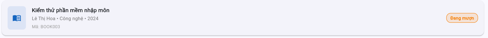

**Proposed Fix:**
Standardize the displayed status label for borrowed books to "Đã mượn" in the book list as required by REQ-02.

---

## BUG-02 — Category filter is case-sensitive

| Attribute           | Details        |
|---------------------|----------------|
| **Bug ID**          | BUG-02         |
| **Related REQ**     | REQ-03         |
| **Related TC**      | TC-14          |
| **Severity**        | Medium         |
| **Reporter**        | STQA_Group_16  |
| **Found On**        | 20/05/2026     |
| **Status**          | Open           |

**Description:**
Category filter returns no Công Nghệ books when the keyword uses different letter case

**Preconditions:**
Reset system. Log in with a random valid account

**Steps to Reproduce:**

1. Open the Sách tab.
2. Select or enter a category in "Lọc".
3. Enter keyword `công nghệ` or `CÔNG NGHỆ`.
4. Observe the result list.

**Expected Result:**
Show books in category "Công Nghệ"

**Actual Result:**
No books are displayed for the selected category.

**Impact:**
Users cannot filter books by category when valid input uses a different letter case from the displayed data, reducing book lookup usefulness.

**Evidence:**
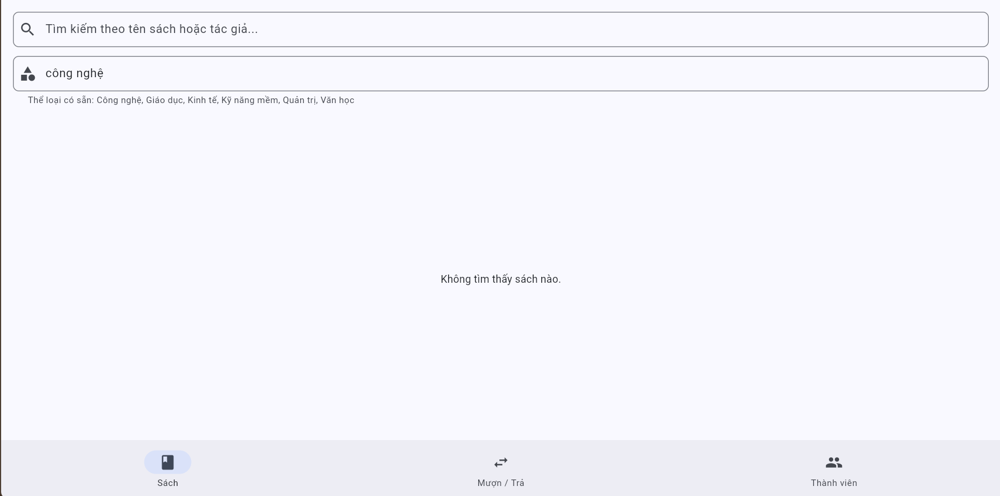
.png)

**Proposed Fix:**
Check the category filtering logic and normalize matching for case-insensitive comparison before querying or filtering data.

---

## BUG-03 — Wrong suggested keywords in English interface

| Attribute           | Details        |
|---------------------|----------------|
| **Bug ID**          | BUG-03         |
| **Related REQ**     | REQ-03         |
| **Related TC**      | TC-16          |
| **Severity**        | Medium         |
| **Reporter**        | STQA_Group_16  |
| **Found On**        | 20/05/2026     |
| **Status**          | Open           |

**Description:**
Filter by Category returns no results for the suggested English keywords

**Preconditions:**
Reset system. Log in with a random valid account.

**Steps to Reproduce:**

1. Switch the interface from Vietnamese to English.
2. Open the Sách tab.
3. Open Filter.
4. Enter a Filter by Category suggestion: `Technology` or `Economics`.
5. Observe the result.

**Expected Result:**
Display books in the Technology or Economics category.

**Actual Result:**
Does not show book information when searching in Filter by Category

**Impact:**
Users of the English interface get no category-filter results from keywords suggested by the interface, making the filter difficult to use.

**Evidence:**
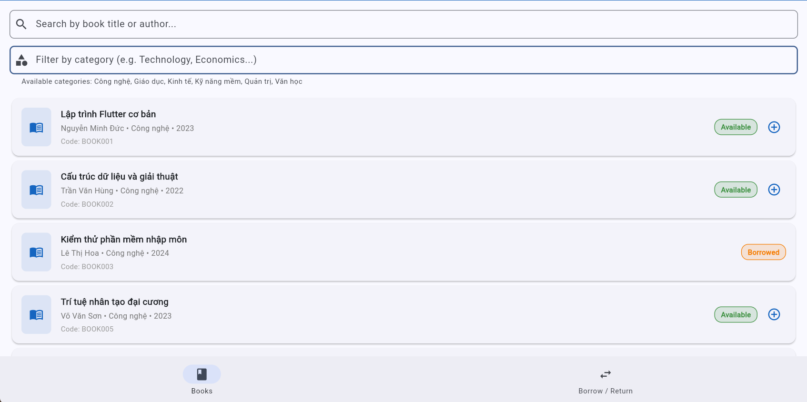
.png)

**Proposed Fix:**
Align category filter values with translated labels and map English keywords to the corresponding category data.

---

## BUG-04 — Member status displayed incorrectly

| Attribute           | Details        |
|---------------------|----------------|
| **Bug ID**          | BUG-04         |
| **Related REQ**     | REQ-04         |
| **Related TC**      | TC-22          |
| **Severity**        | Medium         |
| **Reporter**        | STQA_Group_16  |
| **Found On**        | 20/05/2026     |
| **Status**          | Open           |

**Description:**
"Suspended" account is reported as "expired" when borrowing a book

**Preconditions:**
Reset system. Log in as MEM004.

**Steps to Reproduce:**

1. Log in as `MEM004`.
2. Open the Sách tab.
3. Select `BOOK001`.
4. Click "Mượn".

**Expected Result:**
Reject. Show the suspended-account message instead of the expired-account message

**Actual Result:**
Shows the expired-account message instead of the suspended-account message

**Impact:**
The user receives the wrong account-status message, making the borrow rejection reason unclear and likely to be handled incorrectly.

**Evidence:**
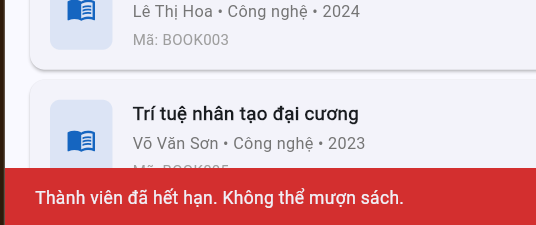

**Proposed Fix:**
Check the member-status branch used for borrow rejection and show the suspended-account message for `MEM004`.

---

## BUG-05 — Exceeding borrow book limit

| Attribute           | Details        |
|---------------------|----------------|
| **Bug ID**          | BUG-05         |
| **Related REQ**     | REQ-04         |
| **Related TC**      | TC-24          |
| **Severity**        | High           |
| **Reporter**        | STQA_Group_16  |
| **Found On**        | 20/05/2026     |
| **Status**          | Open           |

**Description:**
MEM006 can still borrow after reaching the 3-book limit (borrow 4 books)

**Preconditions:**
Reset system. Log in as MEM006.

**Steps to Reproduce:**

1. Log in as `MEM006`.
2. Borrow two more books so the account has 3 borrowed books.
3. Select `BOOK001`.
4. Click "Mượn".

**Expected Result:**
Reject. Show a message for exceeding the 3-book limit

**Actual Result:**
Borrow succeeds; MEM006 can borrow three more books

**Impact:**
The borrowed-book limit is not enforced, violating borrowing rules and allowing a member to hold more books than permitted.

**Evidence:**
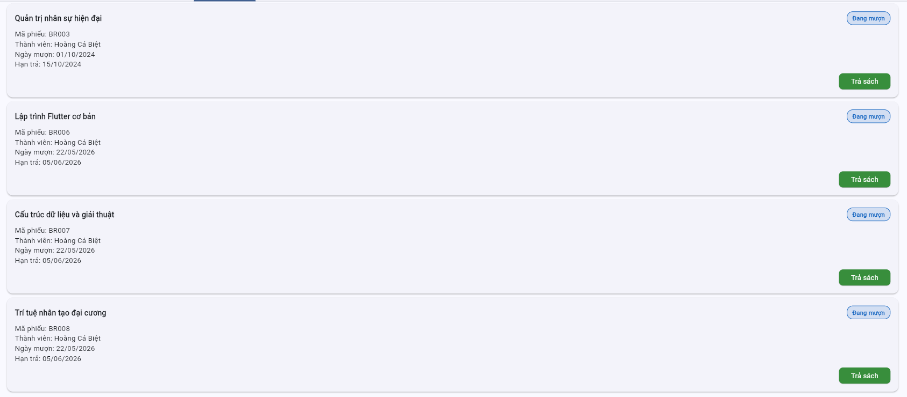

**Proposed Fix:**
Check active borrow record count before creating a new record; when the count reaches 3, reject and show the limit-exceeded message.

---

## BUG-06 — Lack of overdue warning while returning

| Attribute           | Details        |
|---------------------|----------------|
| **Bug ID**          | BUG-06         |
| **Related REQ**     | REQ-05         |
| **Related TC**      | TC-30          |
| **Severity**        | Medium         |
| **Reporter**        | STQA_Group_16  |
| **Found On**        | 20/05/2026     |
| **Status**          | Open           |

**Description:**
Returning overdue BR001 shows no overdue warning

**Preconditions:**
Reset system. Log in as MEM002.

**Steps to Reproduce:**

1. Log in as `MEM002`.
2. Open the Mượn/Trả tab.
3. Select `BR001` with a return date after due date `15/09/2024`.
4. Click "Trả".

**Expected Result:**
Return succeeds and an overdue warning is shown

**Actual Result:**
Return succeeds without a warning

**Impact:**
The user is not told that the record is returned after due date, leaving important information out of the overdue return flow.

**Evidence:**
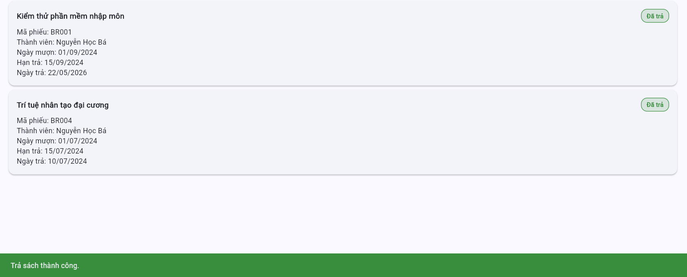

**Proposed Fix:**
After detecting a return date after the due date, keep processing the return but show the overdue warning required by REQ-05.

---

## BUG-07 — Unauthorized return of another member's book

| Attribute           | Details        |
|---------------------|----------------|
| **Bug ID**          | BUG-07         |
| **Related REQ**     | REQ-05         |
| **Related TC**      | TC-36          |
| **Severity**        | High           |
| **Reporter**        | STQA_Group_16  |
| **Found On**        | 20/05/2026     |
| **Status**          | Open           |

**Description:**
MEM006 can return a book for MEM002 through borrow record lookup, which should not be allowed

**Preconditions:**
Reset system. Log in as MEM006.

**Steps to Reproduce:**

1. Log in as `MEM006`.
2. Open Tra cứu phiếu mượn.
3. Look up active member `MEM002`.
4. Return a book from the found record.

**Expected Result:**
Reject the return

**Actual Result:**
Return succeeds

**Impact:**
A member can change another member's borrow/return status, causing record inconsistency and violating the rule that members return only their own books.

**Evidence:**
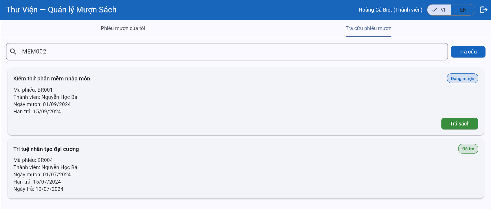
.png)

**Proposed Fix:**
Check record ownership before the return action and reject the action when the record does not belong to the logged-in member.

---

## BUG-08 — Overdue status not displayed

| Attribute           | Details        |
|---------------------|----------------|
| **Bug ID**          | BUG-08         |
| **Related REQ**     | REQ-06         |
| **Related TC**      | TC-39          |
| **Severity**        | Medium         |
| **Reporter**        | STQA_Group_16  |
| **Found On**        | 20/05/2026     |
| **Status**          | Open           |

**Description:**
MEM002 does not see BR001 with status "Quá hạn", since borrowed book is already overdue

**Preconditions:**
Reset system. Excecute TC-35. Log in as MEM002.

**Steps to Reproduce:**

1. Log in as `MEM002`.
2. Open the Mượn/Trả tab.
3. Observe `BR001`.

**Expected Result:**
BR001 displays status "Quá hạn" for MEM002

**Actual Result:**
BR001 does not display status "Quá hạn"

**Impact:**
The member cannot recognize that an own record is overdue, making displayed status information inconsistent with the overdue handling flow.

**Evidence:**
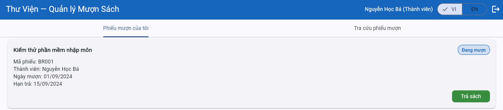
.png)

**Proposed Fix:**
Synchronize the updated overdue status into the record list shown to the owning member.

---

## BUG-09 — Failed to add new member with valid data

| Attribute           | Details        |
|---------------------|----------------|
| **Bug ID**          | BUG-09         |
| **Related REQ**     | REQ-07         |
| **Related TC**      | TC-45          |
| **Severity**        | Medium         |
| **Reporter**        | STQA_Group_16  |
| **Found On**        | 20/05/2026     |
| **Status**          | Open           |

**Description:**
Adding a member with valid data is rejected as invalid email

**Preconditions:**
Reset system. Log in as LIB001.

**Steps to Reproduce:**

1. Log in as `LIB001`.
2. Open the Thành viên tab and click "Thêm".
3. Enter Name `Nguyen Van A`, Email `newuser@domain.com`, Phone `0987654321`.
4. Submit.

**Expected Result:**
Creation succeeds. The member appears in the list

**Actual Result:**
Rejects with an invalid email message

**Impact:**
The librarian cannot create a member with the valid test-case data, interrupting member management.

**Evidence:**
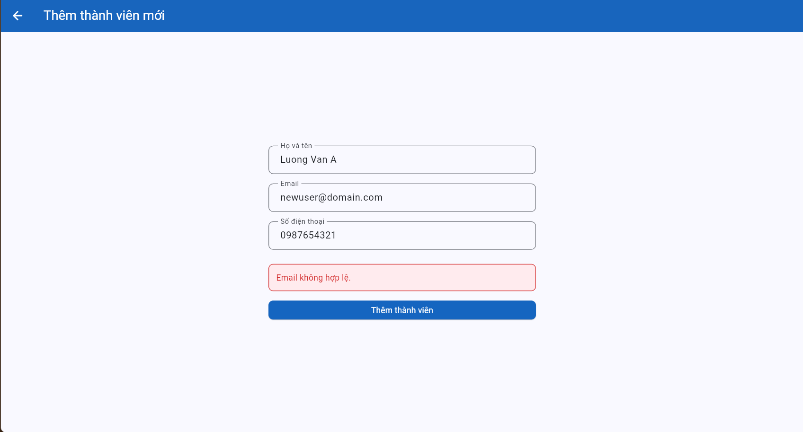

**Proposed Fix:**
Check the email validator for valid cases with `@` and `.` in the domain before rejecting member creation.

---

## BUG-10 — Member can be added with invalid data

| Attribute           | Details        |
|---------------------|----------------|
| **Bug ID**          | BUG-10         |
| **Related REQ**     | REQ-07         |
| **Related TC**      | TC-49          |
| **Severity**        | Medium         |
| **Reporter**        | STQA_Group_16  |
| **Found On**        | 20/05/2026     |
| **Status**          | Open           |

**Description:**
Email missing a dot in the domain can still create a member, which is against email rule

**Preconditions:**
Reset system. Log in as LIB001.

**Steps to Reproduce:**

1. Log in as `LIB001`.
2. Open the add member function.
3. Enter Name `Nguyen Van A`, Email `newuser@domain`, Phone `0987654321`.
4. Submit.

**Expected Result:**
Reject with an invalid email message

**Actual Result:**
Member creation succeeds

**Impact:**
The system stores an account with an email that is invalid under REQ-07, reducing contact-data quality and potentially affecting email-based flows.

**Evidence:**
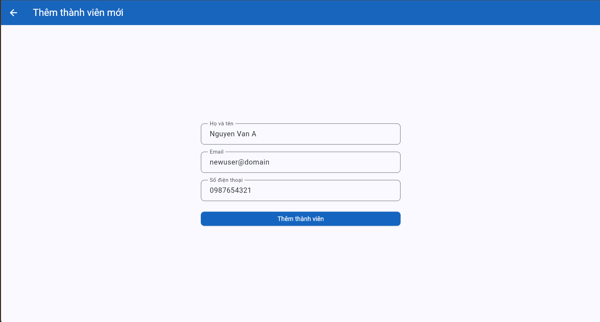
.png)

**Proposed Fix:**
Require email to contain `@` and a `.` in the domain before allowing member creation.

---

## BUG-11 — Wrong warning type in adding new member

| Attribute           | Details        |
|---------------------|----------------|
| **Bug ID**          | BUG-11         |
| **Related REQ**     | REQ-07         |
| **Related TC**      | TC-52          |
| **Severity**        | Low            |
| **Reporter**        | STQA_Group_16  |
| **Found On**        | 20/05/2026     |
| **Status**          | Open           |

**Description:**
Empty phone number reports invalid email instead of invalid phone number

**Preconditions:**
Reset system. Log in as LIB001.

**Steps to Reproduce:**

1. Log in as `LIB001`.
2. Open the add member function.
3. Enter Name `Nguyen Van A`, Email `newuser@domain.com`, and leave Phone empty.
4. Submit.

**Expected Result:**
Reject and show a phone-number error

**Actual Result:**
Rejects with an invalid email message

**Impact:**
The librarian does not receive the correct error for the empty phone-number field, making the input harder to fix.

**Evidence:**
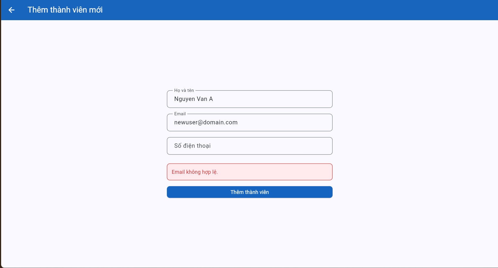

**Proposed Fix:**
Separate empty phone-number validation from email validation and show the phone-number error when Phone is invalid.

---

## BUG-12 — Member can view another member's borrow record

| Attribute           | Details        |
|---------------------|----------------|
| **Bug ID**          | BUG-12         |
| **Related REQ**     | REQ-08         |
| **Related TC**      | TC-55          |
| **Severity**        | High           |
| **Reporter**        | STQA_Group_16  |
| **Found On**        | 20/05/2026     |
| **Status**          | Open           |

**Description:**
MEM006 can view BR004 owned by another member, violating REQ-08 visibility limits

**Preconditions:**
Reset system. Log in as MEM006.

**Steps to Reproduce:**

1. Log in as `MEM006`.
2. Open the Mượn/Trả tab.
3. Check whether the list contains `BR004` owned by `MEM002`.

**Expected Result:**
BR004 does not appear in MEM006's interface

**Actual Result:**
Can view another member's borrow record

**Impact:**
A member can view a borrow record not owned by that member, exposing borrowing information and violating role-based access control.

**Evidence:**
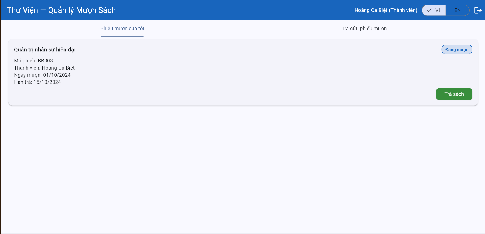

**Proposed Fix:**
Filter borrow records by the logged-in member in both data retrieval and display; only librarians should view records for all members.

## BUG-13 — Borrow record incorrectly marked as overdue

| Attribute           | Details        |
|---------------------|----------------|
| **Bug ID**          | BUG-13         |
| **Related REQ**     | REQ-07         |
| **Related TC**      | TC-41 (Bonus)  |
| **Severity**        | Medium         |
| **Reporter**        | STQA_Group_16  |
| **Found On**        | 01/06/2026     |
| **Status**          | Open           |

**Description:**
BR003 of MEM006 is marked as overdue even though the due date has not passed.

**Preconditions:**
Reset system. Login as LIB001.

**Steps to Reproduce:**

1. Log in as LIB001.
2. Open the Mượn/Trả tab.
3. Locate borrow record BR003 of MEM006.
4. Observe the displayed status.

**Expected Result:**
BR003 of MEM006 show "Đang mượn" ( not overdate )

**Actual Result:**
BR003 of MEM006 show status "Quá hạn"

**Impact:**
Affects data accuracy of book status but does not crash the system or block the main return workflow.

**Evidence:**
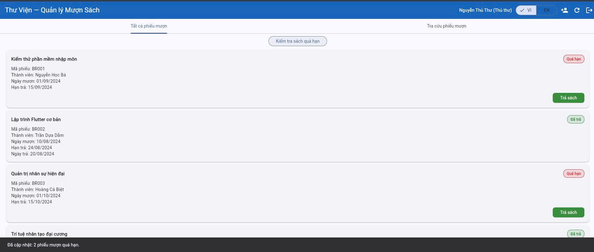

**Proposed Fix:**
Review the overdue-status calculation logic and ensure records are marked as overdue only when the current date exceeds the due date.

## BUG-14 — Borrow count incorrectly reset to zero

| Attribute           | Details        |
|---------------------|----------------|
| **Bug ID**          | BUG-14         |
| **Related REQ**     | REQ-06         |
| **Related TC**      | TC-43 (Bonus)  |
| **Severity**        | Medium         |
| **Reporter**        | STQA_Group_16  |
| **Found On**        | 01/06/2026     |
| **Status**          | Open           |

**Description:**
The system changes the borrowed-book count to "Đang mượn: 0 sách" even though the book has not been returned.

**Preconditions:**
Reset system. Log in as LIB001.
MEM002 has an overdue borrowed book that has not been returned.

**Steps to Reproduce:**

1. Log in as LIB001.
2. Open the Mượn/Trả tab.
3. Click "Kiểm tra sách quá hạn".
4. Open the Thành viên tab.
5. Search for MEM002.
6. Observe the borrowed-book count.

**Expected Result:**
MEM002 should still have 1 borrowed book displayed because the book has not been returned.

**Actual Result:**
The system displays "Đang mượn: 0 sách" even though the book has not been returned.

**Impact:**
Causes data inconsistency in member records, directly impacting the librarian's tracking ability, but a workaround (checking book history) exists.

**Evidence:**
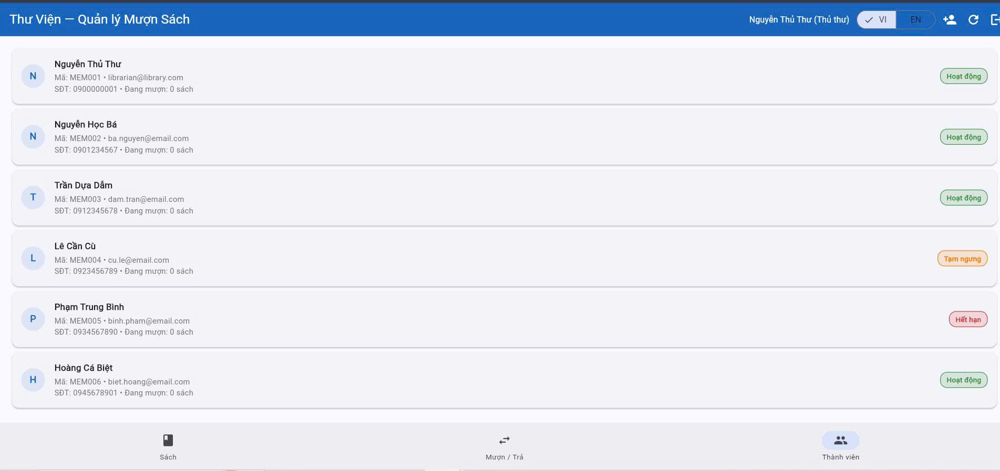

**Proposed Fix:**
Synchronize member borrowing statistics with borrow-record status updates and recalculate the borrowed-book count after overdue processing.

## Notes

- TestCase (Bonus-Bug): TC-16,TC-41,TC-43
- These bugs were not covered by the 8 specific requirements; they were detected during live testing while cross-checking with the SRS. Consequently, we proposed 3 extra test cases
